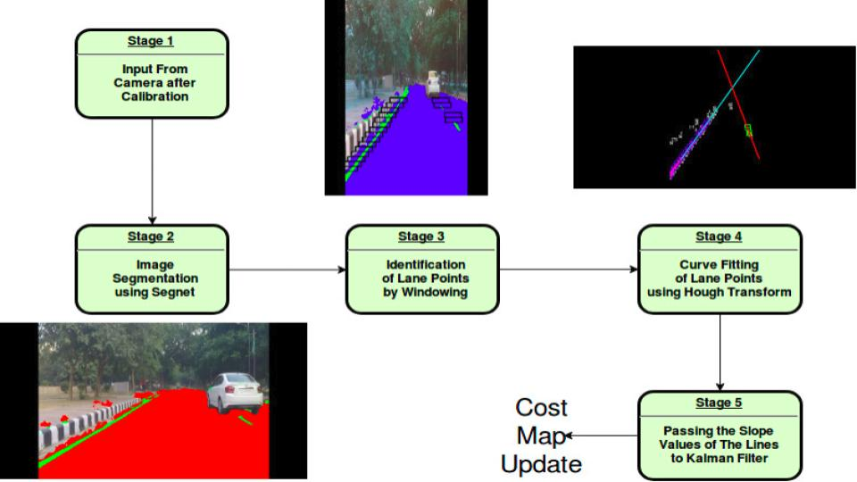

This is the module for doing lane detection for DLive IIT Delhi. We have tested this on the zed_stereo_camera present on our car.

It has scripts that can be used for doing lane segmentation online(by subscribing to ros messages from zed) and offline(using a recorded video)

Dependencies:

	[I'm an inline-style link with title](https://github.com/alexgkendall/caffe-segnet "Caffe-Segnet"). Clone this repo, in the same directory where your lane-detection directory is present, and then build it.

	Download the [I'm an inline-style link with title](https://tinyurl.com/y8un7jdv "weights") and unzip them in the lane_detection directory. 
	
	[I'm an inline-style link with title](http://wiki.ros.org/cv_bridge "ROS CvBridge")

I would recommend going through the lane_detection.py script for a better understanding of the available functionality.

For doing lane detection online, run the script cvbridge.py. This subscribes to the /zed/rgb/image_rect_color topic so make sure your images are being published on this. If they are not you would have to change this topic in the script where the subscriber object is instantiated.

For doing offline lane detection, run test_lane_detection.py by specifying the video path as a command line argument.

The image below will give you a high-level idea about this module works:

This is the link to a demonstration [I'm an inline-style link with title](https://www.youtube.com/watch?v=zAfO1xEGN_I  "video")

